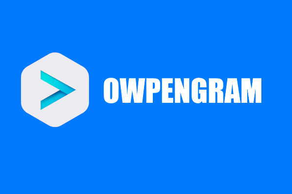

<p align="center">
  
</p>

# 🚀 OwpenGram Server

**Your own private messaging server — self-hosted, protocol-compatible, fully yours.**

The protocol stack is built on the published
[`github.com/iamxvbaba/td`](https://github.com/iamxvbaba/td) module
(`v1.3.2`), using a canonical Layer 229 schema with sparse `tlprofile`
exact Layer 225-229 compatibility profiles.

If you are looking for a **Telegram server**, **MTProto server**,
**Telegram backend**, **Telegram clone server**, or **self-hosted
Telegram-like chat server**, this repository is the server-side implementation
to study, run, and improve.

OwpenGram Server is an open-source, Telegram-compatible MTProto backend written
in Go. Run it on your own network for a private, closed setup, or on a VPS to
be reachable anywhere in the world. Your data, your keys, your rules — no
cloud, no lock-in, no censorship.

> 🔗 Implements **MTProto API layers 225-229** — a client is admitted on the
> exact layer it announces, so older builds keep working after the server moves
> forward. The running server reports its version, the layers it accepts, and
> its build in the admin panel sidebar.

`OwpenGram Server` is independent and unofficial. It is not affiliated with, endorsed by,
or sponsored by Telegram or the official Telegram team.

---

## ✨ Why OwpenGram?

- 🔒 **Private & self-hosted** — messages live on infrastructure you control.
- 🧩 **Telegram-compatible** — works with the OwpenGram Android and Desktop clients.
- 🌍 **Reachable anywhere** — host it globally, or keep it on your own network.
- 🛡️ **Censorship-resistant** — no central authority can shut you down.
- ⚙️ **Single binary** — one Go program prepares keys, runs migrations, serves
  MTProto, and dispatches updates and background workers.
- 📦 **One command to install** — the launcher installs the prerequisites
  it needs (Go, Python, Docker, OpenSSL), brings the stack up, and hands you
  a browser setup wizard.
- 🆓 **Free & open source** — Apache-2.0, audit and extend it freely.

## 🎯 What works today

- 💬 Private chats, groups, supergroups & channels
- 📞 Voice & group calls, live streams, SFU/TURN building blocks
- 🖼️ Media & files — photos, videos, documents, stickers, reactions
- 🪣 Media storage on local disk **or** an S3/MinIO-compatible object store
- 🤖 Bots and mini apps, with a minimal Bot API gateway
- 🏷️ Fragment-style NFT/collectible usernames and bot verification marks
- 📢 Admin-panel broadcasts — announce to every user, or a picked list
- 🔑 Self-hosted "Log in with Telegram" (OpenID Connect) and passkey sign-in
- 🌐 Message translation and AI-assisted compose
- 📇 Contacts, dialogs sync, chat folders, public link landing pages
- 🔎 **Self-configuring clients** — "Add Server" needs only `host:port`; the
  server publishes its DC id, RSA key and identity over a well-known HTTP path
- 👥 **Multi-operator admin panel** — named operator accounts with scoped
  permissions, instead of one shared password
- 🗄️ **Storage management** — usage breakdown, retention rules, and guarded
  purge of orphaned or expired media
- 👋 Welcome messages and login-code templates you can edit from the panel
- 🧙 **First-run web setup wizard** — server identity, public address, Bot API
  and your operator account, then a restart, all from the browser
- 🖥️ Admin API and web UI for operations, plus a TUI server panel to run it all

<details>
<summary><b>📋 Full feature checklist (click to expand)</b></summary>

| Status | Feature | What works today |
|---|---|---|
| ✅ | MTProto server edge | TCP transport, RSA key exchange, auth keys, encrypted sessions, salts, ack/resend, bad messages, RPC dispatch, canonical Layer 229, sparse exact Layer 225-229 compatibility profiles, and a same-port HTTP side that serves WebSocket transport plus the `/owpengram/server-info` and `/owpengram/server-icon` self-configuration endpoints. |
| ✅ | Login and accounts | Development login code, configurable external code delivery (SMS webhook or SMTP), login email as a second factor, email-as-identity sign-up (no phone number needed), sign-in, sign-up, log-out, authorizations, account settings, SRP/password state, WebAuthn passkey sign-in, and a self-hosted Telegram Login (OpenID Connect) provider for third-party sites. |
| ✅ | Users and contacts | User profiles, usernames, profile photos, contact import/search, blocked/privacy state, presence, and last-seen style status. |
| ✅ | Dialogs and sync | Dialog list, pinned dialogs, manual unread, folders/filters, drafts, read boundaries, durable updates, online fan-out, and offline difference recovery. |
| ✅ | Chatlists and public links | Chat folder sharing, exported chatlist invite links, join/import flows, revoked invite handling, public username landing pages, and shared public link landing pages. |
| ✅ | Private chats | Send, history, read receipts, edit, delete, forward, reply, rich entities, grouped/media messages, reactions, scheduled/TTL-oriented paths. |
| ✅ | Rich messages | Telegram Desktop rich text messages, rich content conversion, send/edit/scheduled flows, dialog/history projections, and memory/PostgreSQL persistence. |
| ✅ | AI compose and ChatBot | Input-box rewrite/polish, default and custom tones, addstyle previews, local and external provider chains, streamed `@ChatBot` draft replies, and Business AI reply hooks. |
| ✅ | Message translation | Telegram `messages.translateText`, provider-backed batch translation, peer language settings, per-account rate limits, and privacy-conscious logging defaults. |
| ✅ | Supergroups and channels | Create, join, leave, invite links, participants, admins, forum topics, linked discussion guests, history, send/edit/delete/read, reactions, public search, and previews. |
| ✅ | Media and files | Upload, download, local-disk **or** S3/MinIO-compatible object storage (switchable per deployment, existing files stay reachable after a switch), low-space upload guard, automatic stale-media cleanup, photos, documents, thumbnails, canonical GIFv conversion, external media fetch, web page previews, map tile cache hooks, profile/channel photos. |
| ✅ | Stickers, reactions, and GIFs | Sticker/reaction catalog, seed support, recent/top/default reactions, moderation-oriented reaction paths, and an admin-curated `@gif` inline catalog (categorized, auto-save-to-Saved-GIFs on send, category-icon filtering in the client's GIF picker) served alongside the client's Saved GIFs. |
| ✅ | Collectible usernames and verification | Fragment-style NFT/collectible usernames (mint, transfer, activate/deactivate), the official platform-checkmark flow (`@verifybot`), and a third-party bot-verification mark mechanism (`@marksbot`, icon + description before a name) — the latter is experimental and hidden by default. |
| ✅ | Bots and mini apps | Bot service foundations, callbacks, inline helpers, webview/mini-app paths, a minimal Bot API gateway for libraries such as `python-telegram-bot`, persistent `getUpdates` delivery, and demo tools. |
| ✅ | Calls and live streams | Private call signaling foundations, group call state, RTMP live streaming, scheduled video chats, channel `join_as`, SFU/TURN building blocks, liveness, and expiry workers. |
| ✅ | Admin and operations | Admin API/UI backend, a first-run web setup wizard (server identity, public network fields, optional Bot API gateway, first operator account), named operator accounts with per-section permissions and a wildcard "full access" grant, per-account freeze (admin-set read-only restriction, advertised to the client via appConfig), broadcast messaging (announce from the official account to every user or a picked list), editable welcome and login-code message templates, storage management (usage breakdown, retention rules, guarded purge), shared-device detection across accounts, RBAC-scoped admin API tokens, PostgreSQL migrations, Redis volatile state, retention workers, pprof/debug hooks, load-test helpers, one-click update with a dry run before it applies, and a bundled TUI server panel as an alternative to the web UI. |
| ✅ | Desktop, Android, iOS, and Web focus | Telegram Desktop is the primary target, with Android, iOS, and Web compatibility paths actively covered by the same server. |

Some items are compatibility-first or experimental, but they are real open
server code, not hidden product-only features.
</details>

## ⚡ Quick Start

**1. Clone the repository**

```bash
git clone https://github.com/owpengram/owpengram-server.git
cd owpengram-server
```

**2. Run the launcher**

```bash
./owpengram-server.sh     # Linux
```
```powershell
.\owpengram-server.bat    # Windows
```

The launcher checks what the server needs — Go 1.25+, Python 3, Docker,
OpenSSL — and **installs whatever is missing** instead of handing you a
shopping list: `scripts/install-prereqs.sh` on Arch and Ubuntu/Debian (asks for
root once, then works unattended) or `scripts/install-prereqs.ps1` on Windows
via winget. Run either directly with `--dry-run` to see what it would install
without touching anything.

> Docker on Windows is the one thing the script will not install for you: its
> containers are Linux images, so the daemon needs Docker Desktop's WSL2
> backend. The launcher reports it with a link instead of starting it.

**3. Answer the first-run form**

With the prerequisites in place the launcher opens the server panel. On a fresh
clone it shows a short form instead of the menu — only the values that need a
human decision, with `.env.example` defaults for everything else; the admin API
token and session key are generated for you. Confirm it and the panel writes
`.env`, starts PostgreSQL/Redis, builds both binaries, runs them, and shows the
admin panel address and password ready to copy.

**4. Finish setup in the browser**

Open that address. On a fresh install the panel opens a **web setup wizard**
that walks through the server name, description and icon, the public address
clients will connect to, the optional Bot API gateway, and your own operator
account — then restarts the server so it all takes effect. Nothing has to be
hand-edited to get going.

<details>
<summary><b>🔧 Prefer to do it manually? (click to expand)</b></summary>

Requirements: **Go 1.25+**, **Docker** (or Docker Desktop) for PostgreSQL and
Redis, and OpenSSL.

**Start the infrastructure** (PostgreSQL + Redis)

```powershell
docker compose -f deploy/docker-compose.yml up -d
```

**Build and run the server**

Windows (PowerShell):

```powershell
go build -o bin/gramsrv.exe ./cmd/telesrv
.\bin\gramsrv.exe
```

Linux / macOS:

```bash
go build -o bin/gramsrv ./cmd/telesrv
./bin/gramsrv
```

On first start, the server creates `data/server_rsa.pem`, applies database
migrations, seeds bundled language packs, prepares optional media resources,
starts MTProto on `0.0.0.0:2398`, and brings up the update/media/background
workers in the same process.

> **Default local login code:** `12345` — change it before any real use!

Without the web wizard you also have to fill in `.env` yourself; see
"⚙️ Configuration" below and [`.env.example`](.env.example).

</details>

### 🖥️ Server Panel

The launcher from step 2 is also a cross-platform interactive TUI: once the
prerequisites are in place it drops into a menu that wraps everything above —
Docker naming migration, `docker compose up`, `go build`, and launching both
`owpengram-server` and `owpengram-admin-panel` — so you don't re-run commands
from scratch every time.

What it does:

- 🧙 **First-run setup** — the short `.env` form from step 3. It is the
  only thing the panel offers on a fresh clone; once `.env` exists the menu
  below replaces it, and later changes go through the `.env` editor.
- ▶️ **Start / Stop / Restart** — launches `owpengram-server` and
  `owpengram-admin-panel` as detached background processes; closing the panel
  does **not** stop them, only "Stop" does. Reopening the panel later picks
  the same processes back up and reports live status.
- ⬆️ **Update** — `git pull --ff-only`, rebuilds both binaries, restarts them,
  and re-execs the panel itself so it also picks up any change to its own
  code — one menu action instead of a manual pull/build/restart sequence. The
  web panel has the same action, with a dry run that reports what an update
  would do before anything is applied.
- 📜 **Live log viewer** — tail either binary's log, or both in a split view.
- ⚙️ **`.env` editor** — edit configuration from inside the panel, grouped by
  feature, without hand-editing the file.

### 🏷️ Version and build

The admin panel's sidebar footer identifies exactly what is running:

```text
Version: O7
API layers: 225-229
Build: 7ad68c3
```

- **Version** — the OwpenGram server release line (`O7`).
- **API layers** — every MTProto TL schema layer this binary can talk, read
  straight from the compatibility profiles rather than hardcoded.
- **Build** — the short commit the binary was built from, stamped
  automatically by Go's VCS info (no special build flags needed); a trailing
  `+` means it was built from a working tree with uncommitted changes. Hover
  it for the full hash.

Quote the `Version` / `Build` pair in bug reports — it pins the exact code,
which a release tag alone does not.

### 👥 Operators and permissions

The panel is no longer one shared password. Its **Operators** page creates
named accounts, each with its own login and an explicit set of permissions,
granted per section and per level — for example `accounts.read`
vs `accounts.manage`, `storage.read` vs `storage.manage`, `broadcasts.send`,
`moderation.review`, `server.manage`, `admins.manage`. An operator only sees
the sections they hold a permission for; reaching anything else lands on a
clear 403 screen instead of an empty page.

A **Full access** checkbox at the top of the permission grid grants the `*`
wildcard — everything, including permissions added by future releases. It is
deliberately separate from the grid (which is disabled while it is on), so
"this person is a full admin" and "this person may do these six things" never
get confused.

The one thing the panel will not let you do is lock yourself out: removing
`admins.manage` from the last enabled operator who holds it — by editing,
disabling, or deleting them — is refused, whether the grant is explicit or via
the wildcard. There is always someone left who can manage operators.

Your first operator is created by the web setup wizard. Before it exists, the
panel lets you in with a password it generates for that one purpose — and stops
accepting that generated password the moment the wizard finishes. A password you
set yourself (in Server Settings, or `TELESRV_ADMIN_UI_PASSWORD` in `.env`)
keeps working as a full-access break-glass login alongside the operator
accounts, so leave it unset or treat it like a root password.

### ⚙️ Configuration

[`.env.example`](.env.example) is the complete configuration reference — every
variable is documented there with an explanatory comment, grouped by feature.
Copy it to `.env` and edit, or set the variables directly as environment
variables. Most commonly used variables:

| Variable | Default | Meaning |
|---|---:|---|
| `TELESRV_LISTEN` | `0.0.0.0:2398` | MTProto listen address |
| `TELESRV_ADVERTISE_IP` | `127.0.0.1` | client-reachable fallback IP for media and calls |
| `TELESRV_DC` | `2` | self-hosted DC id |
| `TELESRV_DEV_AUTH_CODE` | `12345` | fixed login code for local development |
| `TELESRV_AUTH_CODE_MAX_ATTEMPTS` | `5` | wrong-code attempts before the code hash is deleted |
| `TELESRV_POSTGRES_DSN` | local Compose DSN | PostgreSQL connection string |
| `TELESRV_REDIS_ADDR` | `127.0.0.1:6399` | Redis address |
| `TELESRV_BLOB_DIR` | `data/blobs` | local media blob directory |
| `TELESRV_PUBLIC_LINK_WEB_ADDR` | empty | optional public link landing listener, for example `127.0.0.1:2401` |
| `TELESRV_BOT_API_ADDR` | empty | optional HTTP Bot API gateway listen address, for example `127.0.0.1:8081` |
| `TELESRV_AI_ENABLED` | `true` | enable AI compose entry points |
| `TELESRV_TRANSLATION_ENABLED` | `true` | enable Telegram message translation RPCs |

Optional OpenAI-compatible, Kimi/Moonshot, Gemini, and Anthropic AI provider
variables, login email/SMTP settings, and Business AI settings are documented
in `.env.example`.

### ✉️ Login codes, email login, and email sign-up

By default the server just uses a fixed development code
(`TELESRV_DEV_AUTH_CODE`, `12345`) for everything and writes it as a durable
777000 message on the account. Three optional, independent features build on
top of that:

**1. External code delivery providers** — send the real login/phone-change
code out via SMS webhook or SMTP instead of only the fixed dev code. An
existing account's durable 777000 message is always written first; the
provider is an *additional* delivery channel, never a replacement.

| Variable | Default | Meaning |
|---|---:|---|
| `TELESRV_PHONE_CODE_DELIVERY_PROVIDER` | `development` | `development` keeps the fixed code; `webhook` generates a random code and posts it to your own SMS webhook (protocol in `TELESRV_OTP_WEBHOOK_URL`/`_SECRET`/`_TIMEOUT`) |
| `TELESRV_EMAIL_CODE_DELIVERY_PROVIDER` | `smtp` | `smtp` sends via `TELESRV_SMTP_*`; `webhook` reuses the same SMS webhook above |

**2. Login email** — an extra verification factor on top of the phone number
(not a replacement for it), similar to Telegram's own login-email feature.

| Variable | Default | Meaning |
|---|---:|---|
| `TELESRV_LOGIN_EMAIL_ENABLE` | `false` | turn the feature on |
| `TELESRV_LOGIN_EMAIL_REQUIRE_SETUP` | `false` | force accounts without a login email to set one during the phone login flow |
| `TELESRV_LOGIN_EMAIL_CODE_LENGTH` | `6` | length of the emailed code |
| `TELESRV_SMTP_HOST` / `_PORT` / `_USERNAME` / `_PASSWORD` / `_FROM` / `_FROM_NAME` / `_TLS` / `_TIMEOUT` | — | outbound SMTP settings, required when the email provider is `smtp` |

**3. Email-as-identity sign-up** — lets patched clients register and log in
with just an email address, no phone number at all. The client encodes the
email into a synthetic `888`-prefixed number and drives the ordinary
`sendCode`/`signUp`/`signIn`/`changePhone` flow unchanged; the server decodes
that number back to the email and delivers the code over the same channel as
login email above (`TELESRV_EMAIL_CODE_DELIVERY_PROVIDER`). The account's
real, visible phone number is a random-looking short number from
`TELESRV_EMAIL_SIGNUP_PHONE_PREFIXES` — cosmetic only, never used to route the
code — so admins can make freshly signed-up accounts look locally flavored
(e.g. `888,380,373`) without any client update.

| Variable | Default | Meaning |
|---|---:|---|
| `TELESRV_EMAIL_SIGNUP_ENABLE` | `false` | turn the feature on (requires the email delivery channel above to be configured) |
| `TELESRV_EMAIL_SIGNUP_PHONE_PREFIXES` | `888` | comma-separated prefixes for the account's cosmetic display number |

### 🪣 Media storage: local disk or S3/MinIO

Uploaded media (photos, documents, stickers) can live on this machine's disk,
or in an S3-compatible object store. `deploy/docker-compose.yml` bundles a
self-hosted **MinIO** container, pre-wired to the defaults below, so `s3` (the
default) works out of the box with no extra setup — point the same variables
at AWS S3 instead if you'd rather not self-host it.

| Variable | Default | Meaning |
|---|---:|---|
| `TELESRV_BLOB_BACKEND` | `s3` | `s3` for MinIO/AWS S3, `localfs` to write to `TELESRV_BLOB_DIR` on disk instead |
| `TELESRV_S3_ENDPOINT` | `127.0.0.1:9000` | S3 API endpoint (MinIO's default) |
| `TELESRV_S3_REGION` | `us-east-1` | S3 region |
| `TELESRV_S3_BUCKET` | `owpengram-media` | bucket name |
| `TELESRV_S3_ACCESS_KEY_ID` / `TELESRV_S3_SECRET_ACCESS_KEY` | `owpengram` / `owpengram123` | credentials — also what seeds MinIO's root user in `docker-compose.yml`; change both before any real use |
| `TELESRV_S3_USE_SSL` | `false` | `true` for AWS S3 or a MinIO behind TLS; local MinIO runs plain HTTP |
| `TELESRV_S3_PATH_STYLE` | `true` | required for MinIO (bucket in the URL path); leave `false` for AWS S3 |

Switching backends only affects new uploads — existing files stay wherever
they were written and remain reachable as long as that backend's settings
stay filled in. MinIO's own web console is reachable at
`http://localhost:9001` (`docker compose -f deploy/docker-compose.yml up -d`
also starts it) using the same access key/secret as above.

Related toggles (defaults in `.env.example`'s Advanced section): a low-space
guard that rejects new uploads once storage nears full, and automatic
cleanup of media no longer referenced by any message.

**Storage management in the panel.** The admin panel's Storage page puts the
rest of this behind a UI: a usage breakdown per media type, an upload size cap
(`TELESRV_STORAGE_MAX_UPLOAD_FILE_BYTES`, validated against the protocol's own
upload ceiling), retention rules that can expire media globally or per type
(`TELESRV_STORAGE_RETENTION_MODE` and the `TELESRV_STORAGE_RETENTION_MAX_AGE*`
family), and a "danger zone" for manual purges by media category and age.

Destructive panel actions — purge, update, restart — all go through the same
three-step flow: type a reason, run a **dry run** that reports exactly what
would happen, then confirm. Nothing irreversible fires on a single click.

## 🔌 Ports to open

When deploying on a public server, open the following according to the
features you enable.

**Minimal (chat only)**

| Port | Protocol | Purpose | Required |
|---|---|---|---|
| 2398 | TCP | MTProto main port; also handles WebSocket when `TELESRV_WEBSOCKET_ENABLE=true` | Yes |

**With admin backend**

| Port | Protocol | Purpose | Notes |
|---|---|---|---|
| 2399 | TCP | Admin REST API | Restrict to trusted IPs or put behind VPN |
| 2600 | TCP | Admin Web UI | Use Nginx/reverse proxy + HTTPS in production |

**Optional features**

| Port | Protocol | Purpose | When needed |
|---|---|---|---|
| 2400 | TCP | RTMP live stream ingest | Live streaming |
| 12399 | UDP | SFU/WebRTC conferencing | Voice/video group calls |
| 12400 | UDP | TURN/STUN server | P2P/call relay |
| 12500-12999 | UDP | TURN relay port range | TURN relay |
| configurable | TCP | Bot API | When `TELESRV_BOT_API_ADDR` is set |
| 2401 example | TCP | Public username/sticker/chatlist landing pages | When `TELESRV_PUBLIC_LINK_WEB_ADDR=127.0.0.1:2401` is set |

**Internal/debug (do not expose publicly)**

| Port | Default bind | Purpose |
|---|---|---|
| 6060 | `127.0.0.1:6060` | pprof debugging endpoint |
| 5432 | `127.0.0.1:5432` | PostgreSQL |
| 6399 | `127.0.0.1:6399` | Redis |
| 9000 | `127.0.0.1:9000` | MinIO S3 API (only when `TELESRV_BLOB_BACKEND=s3` and self-hosting MinIO) |
| 9001 | `127.0.0.1:9001` | MinIO web console |

Make sure `TELESRV_LISTEN=0.0.0.0:2398` is set, and `TELESRV_ADVERTISE_IP`
points to your public IP so clients can connect.

## 🌐 Public link landing pages

The server can serve public landing pages for `/<username>`, profile avatars,
`/addstickers/<shortName>`, `/addemoji/<shortName>`, and `/addlist/<slug>`.

```env
TELESRV_PUBLIC_LINK_WEB_ADDR=127.0.0.1:2401
TELESRV_PUBLIC_BASE_URL=https://your-domain.example
TELESRV_PUBLIC_APP_SCHEME=yourapp
TELESRV_PUBLIC_WEB_BASE_URL=https://web.your-domain.example
TELESRV_PUBLIC_APP_NAME=YourApp
```

In production, keep `TELESRV_PUBLIC_LINK_WEB_ADDR` on loopback and reverse-proxy
the public routes to it with HTTPS.

## 📱 Connect a client

Use the OwpenGram clients, which have a built-in **Add Server** option on the
server-selection screen at login — no source patching or custom build needed.
Both are forks of the official apps, kept on the same TL layer as the server and
rebased on the upstream release that introduced it:

| Client | Upstream base | Upstream commit | TL layer |
|---|---|---|---|
| 💻 [Desktop](https://github.com/owpengram/owpengram-desktop-client) | Telegram Desktop `v7.2.2` | `7b4481b6941212bb9dbf08e533adea97947b0f44` | 229 |
| 🤖 [Android](https://github.com/owpengram/owpengram-android-client) | Telegram for Android `v12.10.1` | `62b56a07ca7e30e39f7fd00a6728d6bbd716ca1c` | 229 |

A stock Telegram client will not connect, since it only trusts Telegram's own
DC list and RSA keys. The server's canonical layer is 229, with exact
compatibility profiles for layers 225-229 — so an older fork build keeps
working after the server moves forward. Locally that server is
`127.0.0.1:2398`, DC id `2`.

**All you need is `host:port`.** On the login screen open server selection →
**Add Server** and type the address (e.g. `chat.example.com:2398`, or
`192.168.1.50:2398`). The client fetches `/owpengram/server-info` from the same
port and fills in the rest by itself — RSA public key, DC id, and the server's
name, description and icon as you set them in the setup wizard. No
`openssl`, no PEM copy-paste.

The RSA key and DC id are still there under **Advanced** if you want to check
or override them. To get the key by hand — for an air-gapped machine, or to
verify what the client fetched — export it from the server's private key:

```bash
openssl rsa -in data/server_rsa.pem -RSAPublicKey_out -out data/server_rsa.pub
```

or just read the JSON the client reads:

```bash
curl http://your-server:2398/owpengram/server-info
```

> Self-configuration rides the same-port HTTP side that also serves the
> WebSocket transport, so it needs `TELESRV_WEBSOCKET_ENABLE=true` (the
> default) and opens no extra port. With it off, fill in **Advanced** manually.

## 🧪 Development: multi-device smoke test

Use separate client working directories so sessions do not share local `tdata`:

```powershell
$tdesktop = "C:\path\to\tdesktop\out\Debug\Telegram.exe"
Start-Process $tdesktop -ArgumentList @("-workdir", "$PWD\.tdata-alice")
Start-Process $tdesktop -ArgumentList @("-workdir", "$PWD\.tdata-bob")
```

Log in with different phone numbers — the local login code is `12345` unless
you changed `TELESRV_DEV_AUTH_CODE`. Recommended checks:

- Send private messages, stickers, media, replies, forwards, edits, deletes,
  and read receipts between two users.
- Keep one device online and restart another device to verify offline
  `updates.getDifference` recovery.
- Open the same account from multiple sessions and confirm current-session
  echoes are not duplicated while other online sessions receive updates.
- Check server logs for no new `NOT_IMPLEMENTED`, `Unhandled RPC`, `bad_msg`,
  panic, or internal errors.

## 📂 Repository layout

```text
owpengram-server.sh/.bat  one-command launcher (installs prerequisites, then the panel)
scripts/install-prereqs.* unattended prerequisite installers (Arch/Ubuntu, Windows)
cmd/telesrv/              server entrypoint
cmd/telesrv-admin/        admin backend and embedded React web UI (incl. the setup wizard)
cmd/telesrv-update/       one-click update helper used by the panels
tui-panel/                interactive TUI server panel (setup, start/stop, update, logs, .env editor)
deploy/                   docker-compose (incl. MinIO), migrations, deploy helpers
data/                     bundled language packs and optional seed data
internal/mtprotoedge/     MTProto transport, auth key, session, ack/resend, server-info endpoints
internal/rpc/             TL router and client compatibility handlers
internal/app/             domain services
internal/domain/          protocol-independent domain models
internal/store/           memory/postgres/redis storage backends
internal/identity/        admin-editable server name, description, and icon
internal/botapi/          minimal HTTP Bot API gateway
internal/seed/            bundled seed catalog loaders
internal/sfu/             real-time SFU experiments
internal/turnsrv/         TURN/STUN building blocks
```

## 🤝 Contributing

This server gets better fastest with real usage and focused fixes:

- Telegram Desktop and Android compatibility reports with reproducible steps.
- RPC traces for startup, sync, chat, media, calls, bots, or edge cases.
- Focused fixes for implemented paths instead of broad rewrites.
- Tests for online/offline updates, multi-device sessions, read state, media,
  and channel behavior.
- Performance work on hot paths such as fan-out, pagination, storage queries,
  media upload/download, and connection handling.

If a change affects visible client behavior, please include the client
version/commit, the RPC path you tested, and whether server logs stayed free
of new `NOT_IMPLEMENTED`, `Unhandled RPC`, `bad_msg`, panic, or internal errors.

## 💬 Community

- 📢 Channel: [@owpengram](https://t.me/owpengram)
- 💬 Chat: [Join the discussion](https://t.me/+sVB6Ymv70jEwNTAy)

OwpenGram Server builds on the open-source
[gramsrv](https://github.com/iamxvbaba/gramsrv) project.

## 📄 License

[Apache License 2.0](LICENSE)

---

⭐ If OwpenGram is useful to you, a star on GitHub helps the project grow.
